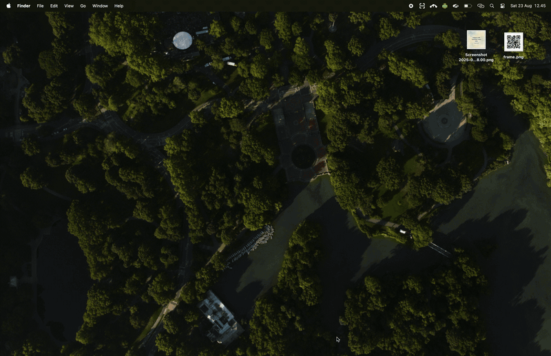

# Tray Scanner

[](https://opensource.org/licenses/MIT)
[](https://electronjs.org)
[](https://nodejs.org)

A powerful macOS system tray application for **QR code scanning** and **OCR text extraction** from screen captures. Built with Electron, this native desktop app provides seamless integration with macOS, offering quick access to scan any part of your screen.



## ✨ Features

- 🔍 **QR Code Scanning**: Quickly scan QR codes from any part of your screen
- 📝 **OCR Text Extraction**: Extract text from images with high accuracy
- 🖥️ **Screen Area Selection**: Intuitive drag-to-select interface
- 🍎 **Native macOS Integration**: Lives in your system tray for instant access
- 📋 **Clipboard Integration**: Automatically copy results to clipboard
- 🔐 **Privacy First**: All processing happens locally on your device
- ⚡ **Fast Processing**: Optimized for quick results
- 🎨 **Beautiful UI**: Modern, native-looking interface

## 🚀 Quick Start

### Prerequisites

- **macOS 10.15** or later
- **Node.js 18** or later
- **Yarn** package manager (recommended) or npm

### Installation

1. **Clone the repository**
   ```bash
   git clone <repository-url>
   cd project\ 2
   ```

2. **Install dependencies**
   ```bash
   yarn install
   # or
   npm install
   ```

3. **Run in development mode**
   ```bash
   yarn dev
   # or
   npm run dev
   ```

4. **Build for production**
   ```bash
   yarn build
   # or
   npm run build
   ```

## 📖 Usage

### Getting Started

1. **Launch the app** - The Tray Scanner icon will appear in your macOS menu bar
2. **Grant permissions** - When first running, you'll be prompted to grant screen recording permissions:
   - Open **System Preferences** (or **System Settings** on macOS 13+)
   - Navigate to **Privacy & Security** → **Screen Recording**
   - Add and enable **Tray Scanner**
   - Restart the application

### Scanning QR Codes

1. Click the **Tray Scanner** icon in your menu bar
2. Select **"Scan QR"**
3. Drag to select the area containing the QR code
4. Release to scan - the result will be displayed and copied to your clipboard

### Extracting Text (OCR)

1. Click the **Tray Scanner** icon in your menu bar
2. Select **"Capture Text"**
3. Drag to select the text area
4. Release to extract - the text will be displayed with confidence score

### Keyboard Shortcuts

- **Escape**: Cancel current selection
- **Cmd+C**: Copy result to clipboard (when result window is open)

## 🛠️ Development

### Project Structure

```
src/
├── main.js              # Main Electron process
├── preload.js           # Preload script for secure IPC
├── capture.html         # Screen capture UI
├── result.html          # Results display UI
└── modules/
    ├── ocrProcessor.js  # OCR text extraction
    ├── qrScanner.js     # QR code scanning
    └── screenCapture.js # Screen capture functionality

tests/
└── modules/             # Unit tests for each module

assets/
└── icon.png            # Application icon
```

### Available Scripts

```bash
# Development
yarn dev              # Run in development mode
yarn test             # Run unit tests
yarn test:watch       # Run tests in watch mode
yarn test:coverage    # Generate test coverage report

# Building
yarn build            # Build distributable app
yarn pack             # Build without creating installer
yarn dist             # Build and create installer
```

### Testing

The project includes comprehensive unit tests for all core modules:

```bash
# Run all tests
yarn test

# Run tests in watch mode during development
yarn test:watch

# Generate coverage report
yarn test:coverage
```

### Architecture Overview

The application follows a modular architecture:

- **Main Process** (`main.js`): Manages tray icon, windows, and IPC communication
- **Screen Capture** (`screenCapture.js`): Handles screen recording permissions and image capture
- **QR Scanner** (`qrScanner.js`): Processes images to detect and decode QR codes
- **OCR Processor** (`ocrProcessor.js`): Extracts text from images using Tesseract.js
- **UI Components**: HTML/CSS/JS for capture interface and results display

## 🔧 Configuration

### OCR Settings

The OCR processor uses English language models by default. To modify:

```javascript
// In ocrProcessor.js
this.worker = await createWorker('eng'); // Change language code here
```

Supported languages include: `eng`, `fra`, `deu`, `spa`, `chi_sim`, `chi_tra`, etc.

### Build Configuration

Electron Builder configuration in `package.json`:

```json
{
  "build": {
    "appId": "com.trayscanners.app",
    "productName": "Tray Scanner",
    "mac": {
      "target": "dmg",
      "category": "public.app-category.utilities",
      "darkModeSupport": true
    }
  }
}
```

## 🔒 Privacy & Security

- **Local Processing**: All OCR and QR scanning happens locally on your device
- **No Data Transmission**: No captured images or extracted data leaves your computer
- **Secure IPC**: Uses Electron's context isolation for secure communication
- **Permission-Based**: Requires explicit screen recording permission from user

## 🐛 Troubleshooting

### Permission Issues

**Problem**: "Screen recording permission not granted" error

**Solution**:
1. Open System Preferences/Settings
2. Go to Privacy & Security → Screen Recording  
3. Add Tray Scanner and enable it
4. Restart the application

### OCR Accuracy Issues

**Problem**: Text extraction is inaccurate

**Solutions**:
- Ensure the text area is clearly selected
- Use higher contrast images when possible
- The app works best with printed text (not handwritten)
- Minimum confidence threshold is set to 30%

### Performance Issues

**Problem**: App feels slow or unresponsive

**Solutions**:
- Restart the application to clear memory
- Ensure your Mac meets minimum system requirements
- Close other resource-intensive applications

## 📋 System Requirements

- **OS**: macOS 10.15 (Catalina) or later
- **Memory**: 100MB RAM minimum
- **Disk Space**: 200MB for installation
- **Permissions**: Screen Recording access required

## 🤝 Contributing

1. Fork the repository
2. Create a feature branch (`git checkout -b feature/amazing-feature`)
3. Make your changes
4. Add tests for new functionality
5. Commit your changes (`git commit -m 'Add amazing feature'`)
6. Push to the branch (`git push origin feature/amazing-feature`)
7. Open a Pull Request

### Development Guidelines

- Follow existing code style and patterns
- Add unit tests for new features
- Update documentation for user-facing changes
- Test on multiple macOS versions when possible

## 📄 License

This project is licensed under the MIT License - see the [LICENSE](LICENSE) file for details.

## 🙏 Acknowledgments

- [Tesseract.js](https://github.com/naptha/tesseract.js) - OCR functionality
- [jsQR](https://github.com/cozmo/jsQR) - QR code detection
- [Sharp](https://github.com/lovell/sharp) - Image processing
- [Electron](https://electronjs.org/) - Cross-platform desktop framework

---

**Made with ❤️ for macOS users who need quick access to screen scanning tools.**
