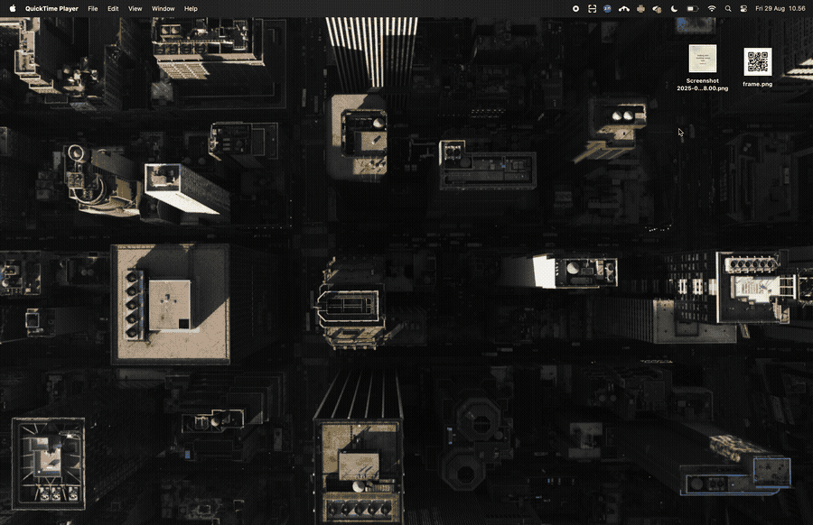

# SayaLens

[](https://opensource.org/licenses/MIT)
[](https://electronjs.org)
[](https://reactjs.org)
[](https://typescriptlang.org)
[](https://vitejs.dev)
[](https://nodejs.org)

**Effortlessly scan QR codes and extract text from your screen.** SayaLens is a streamlined cross-platform system tray app that makes screen scanning simple and efficient. Available for both macOS and Windows, just select any area of your screen and let SayaLens do the work instead of manually typing URLs or copying text from images.

Built with privacy in mind, all processing happens locally on your device. Whether you're capturing text from documents, scanning QR codes from presentations, or extracting information from screenshots, SayaLens provides quick, accurate results without the hassle.



## ✨ Features

- 🔍 **QR Code Scanning**: Quickly scan QR codes from any part of your screen
- 📝 **Fast OCR**: Instant text recognition and extraction from images
- 🖥️ **Screen Area Selection**: Intuitive drag-to-select interface with React UI
- 🖼️ **Multi-Display Support**: Automatically detects and captures from the active monitor where your cursor is located
- 🖥️ **Cross-Platform Support**: Lives in your system tray on both macOS and Windows for instant access
- 📋 **Clipboard Integration**: Automatically copy results to clipboard
- 🔐 **Privacy First**: All processing happens locally on your device - no data leaves your machine
- ⚡ **Lightweight**: Minimal system resources usage for optimal performance
- 🎨 **Clean UI**: Beautiful, intuitive interface with modern shadcn/ui components
- 🌍 **Multi-Language Support**: OCR supports 14+ languages including English, Arabic, Chinese, and more
- 🌓 **Dark/Light Mode Support**: Automatically adapts tray icon to system appearance on macOS and Windows
- 🔷 **TypeScript**: Full type safety and better development experience

## 📥 Download

Get the latest version of SayaLens:

[](https://github.com/nafplann/SayaLens/releases/latest)

## ☕ Support

If you find SayaLens useful, consider supporting the development:

[](https://github.com/sponsors/nafplann)
[](https://buymeacoffee.com/nafplann)

## 🗺️ Roadmap

- **Linux Support**: Expand platform compatibility to include Linux alongside the current macOS and Windows support

## 🛠️ Tech Stack

- **Framework**: [Electron](https://electronjs.org/) with [electron-vite](https://electron-vite.org/)
- **Frontend**: [React 19](https://react.dev/) with [TypeScript](https://typescriptlang.org/)
- **UI Components**: [shadcn/ui](https://ui.shadcn.com/) with [Tailwind CSS](https://tailwindcss.com/)
- **OCR Engine**: [Tesseract.js](https://github.com/naptha/tesseract.js)
- **QR Scanner**: [jsQR](https://github.com/cozmo/jsQR)
- **Image Processing**: [Sharp](https://github.com/lovell/sharp)

## 🚀 Quick Start

### Prerequisites

#### For macOS
- **macOS 10.15** or later
- **Node.js 18** or later
- **Yarn** package manager (recommended) or npm

#### For Windows
- **Windows 10** or later
- **Node.js 18** or later
- **Yarn** package manager (recommended) or npm

### Installation

1. **Clone the repository**
   ```bash
   git clone https://github.com/nafplann/SayaLens.git
   cd SayaLens
   ```

2. **Install dependencies**
   ```bash
   yarn install
   # or
   npm install
   ```

3. **Run in development mode**
   ```bash
   yarn dev
   # or
   npm run dev
   ```

4. **Build for production**
   ```bash
   yarn build
   # or
   npm run build
   ```

5. **Create distributable packages**
   ```bash
   yarn dist
   # or
   npm run dist
   ```

## 📖 Usage

### Getting Started

1. **Launch the app** - The SayaLens icon will appear in your system tray (menu bar on macOS, system tray on Windows)
2. **Grant permissions** - When first running, you may be prompted to grant screen recording permissions:

   #### macOS
   - Open **System Preferences** (or **System Settings** on macOS 13+)
   - Navigate to **Privacy & Security** → **Screen Recording**
   - Add and enable **SayaLens**
   - Restart the application

   #### Windows
   - No additional permissions required - SayaLens works out of the box
   - Windows may show a security warning on first launch - click "More info" and "Run anyway" to trust the application

### Scanning QR Codes

1. Click the **SayaLens** icon in your system tray
2. Select **"Scan QR"**
3. Drag to select the area containing the QR code
4. Release to scan - the result will be displayed in a modern React UI and copied to your clipboard

### Extracting Text (OCR)

1. Click the **SayaLens** icon in your system tray
2. Select **"Capture Text"**
3. Drag to select the text area
4. Release to extract - the text will be displayed in a beautiful interface

### Multi-Display Support

SayaLens automatically detects which monitor you're actively using and provides seamless multi-display support:

- **Smart Display Detection**: The capture window automatically appears on the display where your mouse cursor is located
- **Accurate Screen Capture**: Captures content from the correct monitor, even with different resolutions and scaling factors
- **Consistent Window Positioning**: Result and about windows appear on the same display where you performed the capture
- **Cross-Monitor Compatibility**: Works perfectly with mixed display setups (different resolutions, orientations, and DPI settings)

**How it works:**
1. When you trigger a capture (via menu or keyboard shortcut), SayaLens detects your cursor position
2. The capture overlay appears on the active monitor
3. Screen capture is performed from the correct display with proper scaling
4. Result windows appear on the same monitor for a consistent workflow

### Keyboard Shortcuts

#### Global Shortcuts (work system-wide)
- **macOS**: Cmd+Shift+1 (QR scan) / Cmd+Shift+2 (text capture)
- **Windows**: Ctrl+Shift+1 (QR scan) / Ctrl+Shift+2 (text capture)

#### During Capture
- **Escape**: Cancel current selection
- **Drag & Release**: Select area and process

#### In Result Window
- **Click Copy**: Copy result to clipboard
- **Copy and Close**: Copy result and close the window

## 🤝 Contributing

1. Fork the repository
2. Create a feature branch (`git checkout -b feature/amazing-feature`)
3. Make your changes
4. Add tests for new functionality
5. Run type checking (`yarn typecheck`)
6. Commit your changes (`git commit -m 'Add amazing feature'`)
7. Push to the branch (`git push origin feature/amazing-feature`)
8. Open a Pull Request

### Development Guidelines

- Follow existing code style and patterns
- Use TypeScript for type safety
- Follow React best practices and hooks patterns
- Use shadcn/ui components when possible
- Add unit tests for new features
- Update documentation for user-facing changes
- Test on multiple platforms (macOS and Windows) when possible

## 📄 License

This project is licensed under the MIT License - see the [LICENSE](LICENSE) file for details.

## 🙏 Acknowledgments

- [electron-vite](https://electron-vite.org/) - Fast build tool for Electron apps
- [React](https://react.dev/) - UI framework
- [shadcn/ui](https://ui.shadcn.com/) - Beautiful UI components
- [Tailwind CSS](https://tailwindcss.com/) - CSS framework
- [Tesseract.js](https://github.com/naptha/tesseract.js) - OCR functionality
- [jsQR](https://github.com/cozmo/jsQR) - QR code detection
- [Sharp](https://github.com/lovell/sharp) - Image processing
- [Electron](https://electronjs.org/) - Cross-platform desktop framework
- [TypeScript](https://typescriptlang.org/) - Type safety

---

**Made with ❤️ from Makassar, Indonesia for users who need quick access to modern screen scanning tools.**
